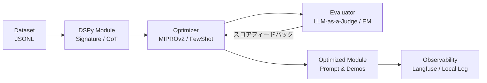

# LaaJ-dspy-looper

DSPyベース プロンプト自動最適化ループシステム (Prompt Optimization Loop with DSPy & LLM-as-a-Judge)

---

## 概要

**LaaJ-dspy-looper** は、DSPy フレームワークを活用して LLM プロンプト（指示文・Few-Shot例）をアルゴリズム的に自動探索・最適化するシステムです。
手作業による試行錯誤のプロンプトエンジニアリングから脱却し、**「宣言的プログラミング ＋ 評価駆動開発（Eval-Driven Development）」** による再現可能なプロンプト最適化サイクルを提供します。



---

## 主な機能

- **宣言的実験管理**: YAML設定ファイル（`experiments/*.yaml`）でタスク、データ、モデル、最適化アルゴリズムを宣言的に定義。
- **多彩な Optimizer 対応**:
  - `BootstrapFewShot`: 少量データからの自動 Few-Shot 抽出
  - `BootstrapFewShotWithRandomSearch`: ランダム探索による最適デモ選択
  - `MIPROv2`: Meta-LLM による指示文（Instruction）自動提案 ＋ ベイズ最適化（Optuna）
  - `KNNFewShot`, `COPRO`
- **柔軟な評価メトリクス**:
  - `exact_match`: 完全一致判定
  - `llm_judge`: LLM-as-a-Judge による論理的評価（`reasoning` 出力付き、Reward Hacking対策）
  - `semantic_similarity`: 意味的類似度スコアリング
  - カスタム Python 関数メトリクスの動的ロード
- **プロンプト差分・エクスポート**:
  - `laaj diff`: 最適化前後のプロンプト指示文や注入されたデモ例の差分をターミナル表示
  - `laaj export`: 最適化結果を JSON / Markdown 形式で出力
- **Observability 連携**:
  - `Langfuse` / `OpenTelemetry` による LLM 呼び出しトレース・レイテンシ・トークン消費の自動可視化
  - ローカル JSON ロギング（オフライン対応）
- **コンテナ対応**: マルチステージビルドによる軽量 `Dockerfile` 提供

---

## クイックスタート

### 1. セットアップ

```bash
# リポジトリのクローン
git clone https://github.com/gon9/LaaJ-dspy-looper.git
cd LaaJ-dspy-looper

# uv による仮想環境構築と依存関係インストール
uv sync --all-extras

# 環境変数の設定
cp .env.example .env
export OPENAI_API_KEY="sk-..."
```

### 2. 学習用ハンズオンの実行 (`examples/`)

```bash
# 01. 基本概念（Signature, Predict, ChainOfThought）
python examples/01_quickstart.py

# 02. カスタム評価関数（Metric）の設計
python examples/02_custom_metric.py

# 03. BootstrapFewShot による Few-Shot 自動最適化
python examples/03_bootstrap_fewshot.py

# 04. MIPROv2 による指示文自動最適化
python examples/04_mipro_optimization.py

# 05. Langfuse によるトレーシング
python examples/05_langfuse_tracing.py
```

### 3. CLI による最適化サイクルの実行

```bash
# 1. ベースライン（最適化前）の性能評価
uv run laaj evaluate --config experiments/example.yaml --baseline

# 2. プロンプト最適化の実行
uv run laaj optimize --config experiments/example.yaml

# 3. 最適化前後のプロンプト差分確認
uv run laaj diff --config experiments/example.yaml --module-path outputs/example_classification/optimized_module.json

# 4. 最適化済みモジュールでの評価
uv run laaj evaluate --config experiments/example.yaml --module-path outputs/example_classification/optimized_module.json

# 5. 最適化結果のエクスポート (Markdown / JSON)
uv run laaj export --config experiments/example.yaml --module-path outputs/example_classification/optimized_module.json --format markdown
```

---

## 設定ファイル（YAML）仕様

```yaml
experiment:
  name: "expense_approval_optimization"
  description: "経費精算承認タスクのプロンプト最適化"

dataset:
  path: "data/expense_approval.jsonl"
  input_fields: ["expense_details"]
  split:
    train: 0.7
    val: 0.15
    test: 0.15

module:
  path: "examples/simple_classifier.py"
  class_name: "SimpleClassifier"

lm:
  provider: "openai"
  model: "gpt-4o-mini"
  temperature: 1.0
  max_tokens: 16000

optimizer:
  name: "BootstrapFewShotWithRandomSearch"
  params:
    max_bootstrapped_demos: 4
    max_labeled_demos: 10
    num_candidate_programs: 8

metric:
  name: "exact_match"
  field: "expected_status"

observability:
  backend: "local"  # "langfuse" または "local"
```

---

## Docker 実行

```bash
# コンテナのビルド
docker build -t laaj-dspy-looper .

# CLI ヘルプの実行
docker run --rm laaj-dspy-looper --help
```

---

## プロジェクト構成

```
LaaJ-dspy-looper/
├── pyproject.toml                  # プロジェクト定義 (uv)
├── Dockerfile                      # マルチステージビルド
├── README.md
├── docs/                           # 詳細ドキュメント群
│   ├── INDEX.md                    # ドキュメント目次
│   ├── SPEC.md                     # 詳細仕様書・事例調査
│   ├── DSPY_OVERVIEW.md            # DSPy 概要・基本概念
│   ├── DSPY_DEEP_DIVE.md           # 技術深掘りガイド
│   ├── DSPY_COMMUNITY_TRENDS.md    # 最新トレンド (DSPy 3.3, GEPA等)
│   └── ENABLEMENT_PLAN.md          # 育成・イネーブルメント計画
├── src/laaj/                       # コアパッケージ
│   ├── cli.py                      # CLI エントリポイント
│   ├── config.py                   # YAML設定バリデーション
│   ├── dataset/                    # Dataset Manager
│   ├── modules/                    # Module Registry
│   ├── metrics/                    # Metric Registry / LLM-as-a-Judge
│   ├── optimizer/                  # Optimizer Engine
│   ├── observability/              # Langfuse / Local Logger
│   └── export/                     # Module Inspector & Diff
├── examples/                       # 学習用ハンズオンチュートリアル (01-05)
├── experiments/                    # 実験定義 YAML
├── data/                           # サンプルデータセット
└── tests/                          # ユニット・統合テスト群
```

---

## ライセンス

MIT License
