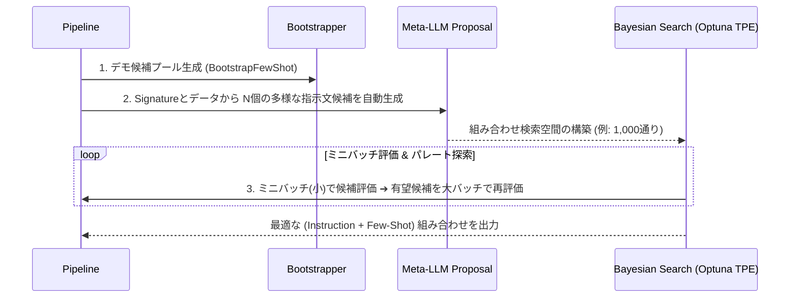

# DSPy 技術深掘りガイド (Technical Deep Dive)

本ドキュメントでは、DSPy の内部メカニズム、設計思想、高度なプロンプトエンジニアリングおよびプロダクション運用に必要な技術要素を詳細に解説します。

---

## 1. DSPy Signature vs 伝統的なプロンプト（Prompt Decay 回避）

### 伝統的プロンプトの課題
手作業で作成するプロンプト（例: `"You are a helpful assistant. Given this context: {context}..."`）は、**「何を計算するか（タスク定義）」と「LLMにどう指示するか（具体的な文言・トーン）」が混在**しています。
モデルを更新（例: GPT-4 ➔ Claude 3.5 ➔ Llama 3 ➔ Gemini 3.7）すると、プロンプトの微小な文言差異により性能が低下する **Prompt Decay（プロンプト劣化）** が発生します。

### DSPy Signature の設計
`dspy.Signature` は入出力の「型契約（Contract）」のみを宣言的に定義します。

```python
class AnswerFromContext(dspy.Signature):
    """Answer questions from a knowledge base context."""
    context: str = dspy.InputField(desc="Relevant passages from the KB")
    question: str = dspy.InputField()
    answer: str = dspy.OutputField(desc="Concise factual answer, under 50 words")
```
Docstringや `desc` はシード（種）であり、コンパイラ（Optimizer）が対象モデルに合わせて最適な指示文（Instruction）を自動発見・書き換えるためのメタデータとして機能します。

---

## 2. モジュールの選定方針 (`Predict` vs `ChainOfThought` vs `ReAct`)

DSPy 3.x では `dspy.Predict` が基底クラスとなり、設定駆動で動作します。

| モジュール | 特徴 | 適用ユースケース | コスト/レイテンシ |
| :--- | :--- | :--- | :--- |
| **`dspy.Predict`** | 直列な Input ➔ Output 変換。思考トークンなし。 | 分類、エンティティ抽出、定型変換 | 最少 (トークン削減 20–40%) |
| **`dspy.ChainOfThought`** | `reasoning` フィールドを自動前挿入し、ステップバイステップで推論。 | 複合問合せ、論理的推論、計算・解釈 | 中 (+5〜15% 精度向上, 推論トークン増) |
| **`dspy.ReAct`** | Thought ➔ Action (Tool) ➔ Observation の自己ループ。 | 外部検索、コード実行、API連携 | 高 (複数回LLM呼び出し) |

---

## 3. BootstrapFewShot の内部メカニズム

手作業の Few-Shot 選択と異なり、`BootstrapFewShot` はパイプライン内の**全サブモジュールに対する最適な中間例**を自動抽出します。

```
[学習データ] ➔ [Teacherモデルで実行] ➔ [全トレース(Trace)記録] ➔ [Metricで評価] ➔ [成功トレースからFew-Shot例を生成・注入]
```

1. **Teacher Forward Pass**: 教師モデル（または自身）でパイプラインの `forward()` を実行。中間 `dspy.Predict` や `ChainOfThought` の入力・思考・出力を全記録。
2. **Trace Filtering (Bootstrap)**: 最終出力が Metric スコアをクリアした成功トレースのみをフィルタリング。
3. **Multi-Module Propagation**: 多段パイプラインの各中間モジュールに対して、それぞれの成功トレースから抽出した Few-Shot 例を個別に注入。

---

## 4. MIPROv2 (Multiprompt Instruction PRoposal Optimizer v2) の仕組み

MIPROv2 は、指示文（Instruction）と Few-Shot 例の双方を探索する最先端のベイズ最適化アルゴリズムです。



- **Phase 1: Bootstrapping**: デモ例の候補プールを生成。
- **Phase 2: Instruction Proposal**: Meta-LLM が Signature とタスク定義を解析し、多様な表現（短い文、詳細な文、別アプローチ等）の指示文候補を複数生成。
- **Phase 3: Bayesian Search (Optuna TPE)**: Optuna の TPE を使用し、初期は小規模ミニバッチで高速探索、後半は大集計バッチで統計的確信度を高めながらグローバル最適解を発見。

---

## 5. Metric エンジニアリング & Reward Hacking ガード

### 評価関数のスペクトラム
1. **Exact Match (EM)** / **F1 Score**: 決定論的で高速・無料。分類や既知エンティティ向き。
2. **Semantic Similarity**: 埋め込みベクトルのコサイン類似度。言い換えを許容。
3. **LLM-as-a-Judge**: 自由記述や要約の評価。

### LLM-as-a-Judge での Reward Hacking（報酬ハック）対策
Optimizer が「長文を書けば高スコアになる」といった評価関数の抜け穴を学習してしまう現象への対策：

- **`reasoning` の必須化**: `score` を出す前に必ず評価理由を出力させる。
- **ドキュメントでの負の条件記述**: Signature に `"Do not reward verbosity"`, `"Penalize missing evidence"` 等を明記。
- **対立的検証 (Adversarial Check)**: ハックされやすい意地悪なデータでメトリクス自体をテストする。

---

## 6. DSPy Assertions と動的バックトラッキング (`dspy.Assert`)

`dspy.Assert(condition, message, backtrack=True)` は、LLMの生成結果に対して動的バリデーションと修正再試行を行います。

```python
class CitedRAG(dspy.Module):
    def forward(self, context, question):
        result = self.generate(context=context, question=question)
        # 引用インデックスが範囲内か検証
        dspy.Assert(
            all(0 <= i < len(context) for i in result.citations),
            "All citation indices must be valid passage numbers.",
            backtrack=True
        )
        return result
```

- **推論時**: アサーション失敗時、エラーメッセージがコンテキストに追記され、LLMが再試行（Retries）を実行。
- **コンパイル時**: **「失敗 ➔ 修正再試行 ➔ 最終成功」のトレース自体が Few-Shot 例として蓄積**されるため、コンパイル後のプログラムは推論時にアサーションエラーを起こさなくなる。

---

## 7. Typed Output & Pydantic バリデーション

Pydantic スキーマを用いた型安全な構造化出力の統合。

```python
from pydantic import BaseModel, Field

class AnalysisResult(BaseModel):
    summary: str = Field(description="Summary of analysis")
    score: float = Field(ge=0.0, le=1.0)
    category: str

class AnalyzeTask(dspy.Signature):
    text: str = dspy.InputField()
    result: AnalysisResult = dspy.OutputField()
```

- **内部変換**: OpenAI (JSON Schema / Structured Outputs), Anthropic (Tools API), ローカルLLM (GBNF / LARK logit grammars) に自動変換。
- **Pydantic Validation**: 型不一致や範囲外エラーが発生すると、`dspy.Assert` と同様の自己修復再試行が動作。

---

## 8. Prompt Overfitting（過学習）対策とデータセット分割

プロンプトが特定の訓練データ（例: 50件）の表現に過剰適合し、テストデータで精度が急降下する問題。

### 鉄則ガイドライン
- **データセット分割**:
  - `trainset` (200件以上推奨): Optimizer がトレースを生成・提案するために使用。
  - `valset` (50件): MIPROv2 が指示文候補のスコアリングに使用。
  - `testset` (50件以上): コンパイル完了まで一切触れない最終評価用。
- **Optimizer選定**:
  - 10〜50件: `BootstrapFewShot`
  - 50〜200件: `BootstrapFewShotWithRandomSearch`
  - 200件以上 + 十分な計算時間: `MIPROv2`
