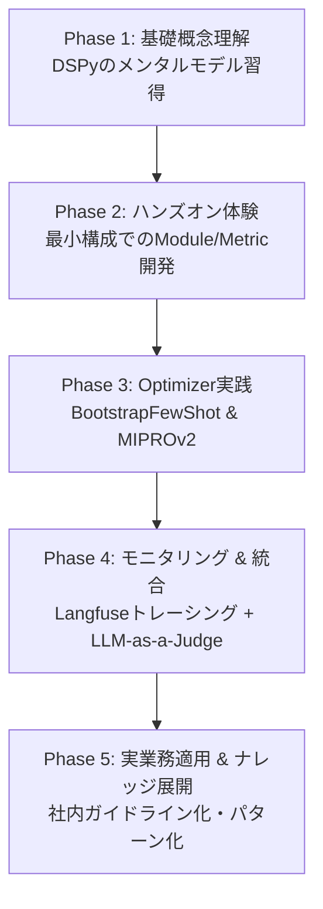

# DSPy イネーブルメント計画 (Enablement Plan)

## 1. 目的

チームメンバーおよび関連エンジニアが DSPy を理解し、業務において**評価駆動開発（Eval-Driven Development）**および**プロンプト自動最適化ループ**を実践・導入できるようにするための学習・育成計画です。

---

## 2. イネーブルメント ロードマップ

### Phase 1: 基礎概念理解（所要時間目安: 1〜2時間）
- **ゴール**: プロンプト手動作成から「宣言的プログラミング＋自動最適化」への思考切り替え。
- **学習コンテンツ**:
  - `docs/DSPY_OVERVIEW.md` の確認。
  - `docs/SPEC.md` の事例調査（LayerX, note, Jina AI）の読解。
  - 核心用語（Signature, Module, Metric, Optimizer）の整理。

### Phase 2: ハンズオン体験 - 最小構成（所要時間目安: 2〜3時間）
- **ゴール**: 自分の手で `dspy.Signature` と `dspy.Module` を書き、LLMを呼び出す。
- **ハンズオン課題**:
  - `examples/01_simple_predict.py`: 簡単な分類/要約タスクの作成。
  - `examples/02_chain_of_thought.py`: `dspy.ChainOfThought` による思考プロセスの付与。
  - 簡単なルールベース Metric (完全一致、キーワード含有チェック) の作成。

### Phase 3: Optimizer（自動最適化）実践（所要時間目安: 3〜4時間）
- **ゴール**: 評価データを用意し、Optimizer がプロンプト（Few-shot / Instruction）を勝手に良くする過程を体感する。
- **ハンズオン課題**:
  - データセット（10〜50件の評価データ）の準備。
  - `BootstrapFewShot` を用いた Few-Shot 例の自動選択。
  - `MIPROv2` を用いた Instruction（指示文）の自動改変。
  - 最適化前後のスコア比較およびプロンプト変化の観察。

### Phase 4: ディープダイブ & 高度な技術要素（所要時間目安: 3時間）
- **ゴール**: インタビュー設問レベルの細かな内部メカニズム（MIPROv2 ベイズ検索, `dspy.Assert` バックトラッキング, Pydantic 統合, 過学習防止）を習得する。
- **学習コンテンツ**:
  - `docs/DSPY_DEEP_DIVE.md` の読解。
  - Pydantic スキーマによる型安全抽出と `dspy.Assert` による再試行ループの実装。
  - 訓練/検証/テスト分割による過学習の評価検証。

### Phase 5: モニタリング & LLM-as-a-Judge 統合（所要時間目安: 3時間）
- **ゴール**: 実業務で必要な「可視化（Langfuse）」と「高度な評価（LLM-as-a-Judge）」を組み込む。
- **ハンズオン課題**:
  - OpenTelemetry / Langfuse 連携によるトレース表示。
  - 複雑な出力（評価理由＋スコアなど）に対する `LLM-as-a-Judge` メトリクス関数設計 (`trace=None` のハンドリング含む)。

### Phase 6: 実業務適用 & ナレッジ展開（継続的）
- **ゴール**: チーム開発・プロダクション環境への導入基準作成。
- **参考リソース**:
  - `docs/DSPY_COMMUNITY_TRENDS.md` (DSPy 3.0, GEPA, ReActV2 などのコミュニティ最新トレンドのキャッチアップ)
  - データ件数に応じた Optimizer 選定ガイドライン。

---

## 3. 作成予定の学習用サンプルコード（`examples/` 構成案）

| ファイルパス | 内容 | 目的 |
| :--- | :--- | :--- |
| [01_quickstart.py](file:///Users/gon9a/workspace/ai-agent/LaaJ-dspy-looper/examples/01_quickstart.py) | 最もシンプルなDSPy実行 | LLM設定とSignatureの使い方 |
| [02_custom_metric.py](file:///Users/gon9a/workspace/ai-agent/LaaJ-dspy-looper/examples/02_custom_metric.py) | カスタム評価関数の作成 | 正解データとモデル出力の照合 |
| [03_bootstrap_fewshot.py](file:///Users/gon9a/workspace/ai-agent/LaaJ-dspy-looper/examples/03_bootstrap_fewshot.py) | BootstrapFewShotの実践 | Few-Shot追加による精度変化の体感 |
| [04_mipro_optimization.py](file:///Users/gon9a/workspace/ai-agent/LaaJ-dspy-looper/examples/04_mipro_optimization.py) | MIPROv2による指示文自動最適化 | Instruction変更の自動化を観察 |
| [05_langfuse_tracing.py](file:///Users/gon9a/workspace/ai-agent/LaaJ-dspy-looper/examples/05_langfuse_tracing.py) | Langfuseトレーシング連携 | DSPy内部呼び出しの可視化 |

---

## 4. Git・コミット管理方針

現在、リポジトリ上の変更（`docs/`, `src/`, `pyproject.toml` 等）がまだローカルコミットおよびリモート push されていない状態です。

### アクションプラン
1. **初期コミットの作成**: 本ドキュメント群およびプロジェクト初期コードをコミット。
2. **`main` ブランチへの Push**: `git push -u origin main` で GitHub リモートリポジトリへ保存。
3. **機能追加のブランチ運用**: 以降のハンズオン例や機能追加は PR ベースまたは機能ブランチで進める。
