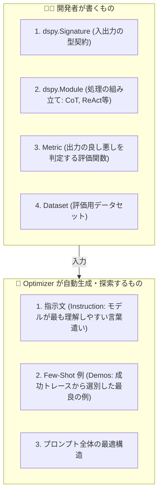
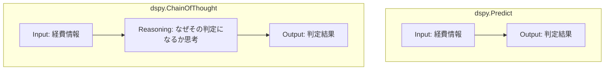
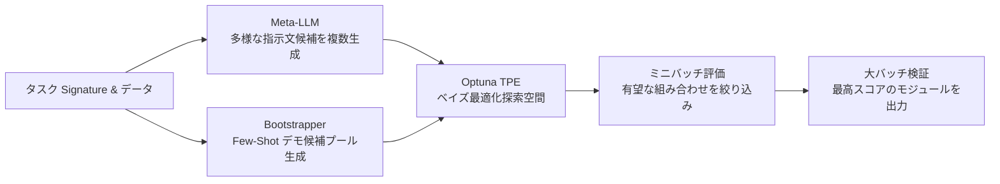
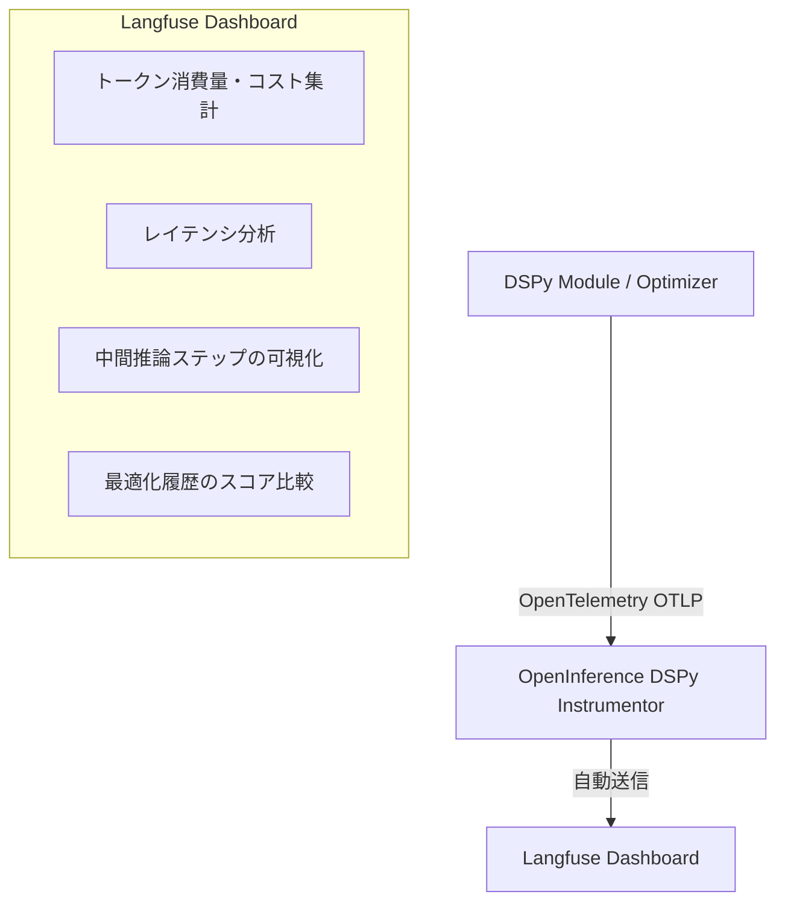
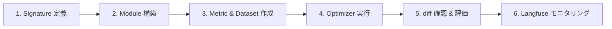

# DSPy 体系的学習マスターガイド (Learning Master Guide)

> **対象**: LLM アプリケーション開発者、プロンプト最適化を自動化したいエンジニア  
> **ゴール**: 評価駆動開発（Eval-Driven Development）と自動プロンプト最適化ループを自力で設計・構築できるようになる

---

## 📑 目次

- [Chapter 1: DSPy メンタルモデル & 思考のパラダイムシフト](#chapter-1-dspy-メンタルモデル--思考のパラダイムシフト)
- [Chapter 2: 入出力設計（Signature）& モジュール構築（Module）](#chapter-2-入出力設計signature--モジュール構築module)
- [Chapter 3: 評価関数（Metric）エンジニアリング & trace 引数](#chapter-3-評価関数metricエンジニアリング--trace-引数)
- [Chapter 4: 自動最適化（Optimizer）の実践 (BootstrapFewShot & MIPROv2)](#chapter-4-自動最適化optimizerの実践-bootstrapfewshot--miprov2)
- [Chapter 5: LLM-as-a-Judge, 差分比較 & Observability (可視化)](#chapter-5-llm-as-a-judge-差分比較--observability-可視化)

---

# Chapter 1: DSPy メンタルモデル & 思考のパラダイムシフト

## 1. 従来のプロンプトエンジニアリングの限界

従来のプロンプト開発では、人間が手作業で以下を行っていました：
- 「あなたは親切なアシスタントです...」のような指示文（Instruction）の試行錯誤
- 「例えば以下のように出力してください...」という Few-Shot 例の手動選定
- モデルの機嫌を取るための文末調整やキーワードの追加

### 発生する課題（Prompt Decay: プロンプト劣化）
手作業で調整したプロンプトは、基盤モデル（例: GPT-4o ➔ Claude 3.5 ➔ Gemini 3.7 ➔ ローカルLLM）を変更した瞬間、またはタスクの微小な仕様変更があった瞬間に **精度が急激に低下（劣化）** します。

```mermaid
flowchart LR
    subgraph Traditional["従来の開発"]
        A1[タスク変更 / モデル変更] --> B1[プロンプトを手動で書き直し]
        B1 --> C1[目視確認]
        C1 -->|精度低下| B1
    end

    subgraph DSPy["DSPy による開発"]
        A2[タスク変更 / モデル変更] --> B2[型と評価関数をそのまま保持]
        B2 --> C2[Optimizer を再実行 (自動探索)]
        C2 --> D2[新モデルに最適なプロンプトが自動生成]
    end
```

---

## 2. PyTorch と DSPy のメンタルモデル対比

DSPy (Declarative Self-improving Python) は、**PyTorch の設計思想を LLM プログラミングに適用したもの** です。

| 開発要素 | PyTorch (機械学習) | DSPy (LLMプログラミング) | 担当 |
| :--- | :--- | :--- | :--- |
| **タスク契約** | Tensor の shape (`torch.Size([B, D])`) | **`dspy.Signature`** (`input -> output`) | **🧑‍💻 開発者** |
| **処理構造** | `nn.Module` (Linear, Conv 等の結合) | **`dspy.Module`** (`Predict`, `ChainOfThought` 等) | **🧑‍💻 開発者** |
| **評価基準** | `Loss Function` (MSE, CrossEntropy 等) | **`Metric`** (EM, LLM-as-a-Judge 等) | **🧑‍💻 開発者** |
| **最適化対象** | モデルの重み・パラメータ (Weights) | **指示文 (Instructions) と Few-Shot 例 (Demos)** | **🤖 Optimizer** |
| **探索手法** | 勾配降下法 (SGD, Adam 等) | **Bootstrap, ベイズ最適化, 遺伝的アルゴリズム** | **🤖 Optimizer** |

---

## 3. 開発者とアルゴリズムの明確な役割分担

> [!IMPORTANT]
> **黄金律**: 開発者は「**何を入力して何を出すか（型）**」と「**どういう処理の流れか（構造）**」だけをコードで定義する。
> 「**どんな文言で指示するか**」「**どんな例を載せるか**」は **アルゴリズム（Optimizer）に完全委譲する**。



---

# Chapter 2: 入出力設計（Signature）& モジュール構築（Module）

## 1. Signature の定義: 2つのスタイル

Signature は、LLM に対して「何を入力し、何を出力するか」を定義するインターフェースです。

### 記法 A: クラスベース定義（推奨・実務向け）
Pydantic 風にフィールドごとの型や説明文（`desc`）を明記できます。

```python
import dspy

class ExpenseApprovalSignature(dspy.Signature):
    """提出された経費申請内容を審査し、承認(approved)または否認(rejected)を判定する。"""

    expense_details: str = dspy.InputField(desc="経費申請の詳細（品目、金額、理由等）")
    approval_status: str = dspy.OutputField(desc="approved または rejected")
```

### 記法 B: インライン定義（簡易プロトタイピング向け）
```python
# "入力1, 入力2 -> 出力1, 出力2"
qa_sig = dspy.Signature("context, question -> answer")
sentiment_sig = dspy.Signature("text -> sentiment: str")
```

---

## 2. 推論モジュール（Modules）の選定と使い分け

| モジュール | 動作 | 適用ユースケース | コスト / 速度 |
| :--- | :--- | :--- | :--- |
| **`dspy.Predict`** | 入力から直接出力を生成 | 単純分類、エンティティ抽出、短い定型変換 | 最速・最安 (トークン消費小) |
| **`dspy.ChainOfThought`** | `reasoning` フィールドを前挿入して思考 | 論理的推論、複数条件の判定、要約、審査 | 高精度 (+5〜15% 向上), 中速 |
| **`dspy.ReAct`** | Thought ➔ Action (Tool) ➔ Observation ループ | 外部検索、コード実行、Web検索を伴うAgent | 高機能, 複数回LLM呼出 |



---

# Chapter 3: 評価関数（Metric）エンジニアリング & trace 引数

## 1. データセットの準備と `dspy.Example`

```python
import dspy

example = dspy.Example(
    expense_details="クライアントとの懇親会飲食代 15,000円 (参加者3名、事前伺い済)",
    expected_status="approved",
    department="営業部"
).with_inputs("expense_details")
```

> [!IMPORTANT]
> **`.with_inputs("フィールド名")` の指定が必須**:
> どのフィールドを「入力」とし、どのフィールドを「評価用メタデータ」とするかを区別します。

---

## 2. Metric 関数のインターフェースと `trace` 引数の二重性

```python
def my_metric(example, pred, trace=None) -> float:
    # 0.0 〜 1.0 のスコア（または bool）を返す
```

| 実行フェーズ | `trace` の値 | 役割 | 推奨される戻り値 |
| :--- | :--- | :--- | :--- |
| **学習時 (Optimization中)** | `trace is not None` | **損失関数 (Loss Function)** | **連続値スコア（部分点あり）**<br>例: 0.0, 0.5, 0.8, 1.0 |
| **評価時 (Test/Validation)** | `trace is None` | **評価指標 (Evaluation Metric)** | **厳格な判定スコア**<br>例: 1.0 (合格) / 0.0 (不合格) |

```mermaid
flowchart TD
    M[Metric 関数呼び出し] --> C{trace 引数の判定}
    C -->|trace is not None<br>Optimizer 探索中| L[損失関数モード<br>・部分点を付与<br>・探索勾配を作る]
    C -->|trace is None<br>テスト・検証中| E[評価指標モード<br>・厳格な判定 (1.0 or 0.0)<br>・正確な集計]
```

---

# Chapter 4: 自動最適化（Optimizer）の実践 (BootstrapFewShot & MIPROv2)

## 1. Optimizer の選定マトリクス

| データ量目安 | 推奨 Optimizer | 最適化対象 | 特徴・使いどころ |
| :--- | :--- | :--- | :--- |
| **〜10件** | `BootstrapFewShot` | Few-Shot デモ例 | 最速・低コスト。成功した実行トレースをプロンプトに埋め込む。 |
| **10〜50件** | `BootstrapFewShotWithRandomSearch` | Few-Shot デモ例 | 複数パターンのデモ候補をランダム探索し、最も高スコアな組み合わせを選択。 |
| **50件〜200件以上** | **`MIPROv2`** (業界標準) | **指示文 + Few-Shot** | **Meta-LLM による指示文自動生成 ＋ Optuna ベイズ最適化**。最大の性能向上。 |
| **類似検索** | `KNNFewShot` | Few-Shot デモ例 | 入力テキストに意味的に最も近い事例を実行時に動的取得（埋め込み利用）。 |
| **指示文のみ** | `COPRO` | 指示文 (Instruction) | Few-Shot を増やさずにプロンプトを短く保ちたい場合。 |

---

## 2. `MIPROv2` (Multiprompt Instruction PRoposal Optimizer v2) の威力



1. **Instruction Proposal (指示文提案)**: Meta-LLM が Signature とデータを分析し、多角的な指示文を自動生成。
2. **Bayesian Optimization (ベイズ探索)**: Optuna の TPE アルゴリズムを用い、指示文と Few-Shot デモの組み合わせから最高精度のプロンプトを発見。

---

# Chapter 5: LLM-as-a-Judge, 差分比較 & Observability (可視化)

## 1. プロンプト差分の確認 (`laaj diff`)

```bash
uv run laaj diff --config experiments/example.yaml --module-path outputs/example_classification/optimized_module.json
```

```text
============================================================
⚡ プロンプト最適化 差分レポート
============================================================

[Predictor: classifier]
  📝 指示文 (Instruction) の変更:
    - Before: テキストを分類するタスク
    + After : 顧客の文脈とトーンを考慮し、不満やトラブルに関する発言は negative、感謝や満足は positive と分類する。
  🎯 Few-Shot Demos: 0 件 ➔ 4 件 (差分: +4 件)
============================================================
```

---

## 2. Langfuse によるモニタリング



---

## 🏁 まとめ & 開発サイクル



これで DSPy によるプロンプト自動最適化サイクルの全容をマスターしました！
実務での各タスクに合わせて `experiments/*.yaml` を作成し、`laaj optimize` を実行してみましょう。
