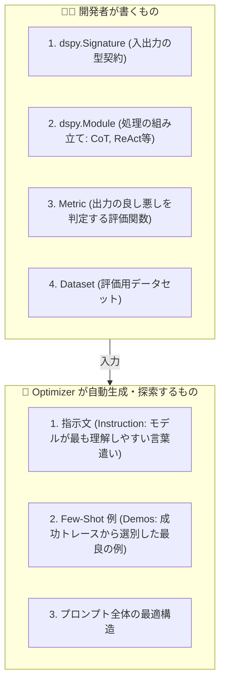

# Chapter 1: DSPy メンタルモデル & 思考のパラダイムシフト

## 1. 従来のプロンプトエンジニアリングの限界

従来のプロンプト開発では、人間が手作業で以下を行っていました：
- 「あなたは親切なアシスタントです...」のような指示文（Instruction）の試行錯誤
- 「例えば以下のように出力してください...」という Few-Shot 例の手動選定
- モデルの機嫌を取るための文末調整やキーワードの追加

### 発生する課題（Prompt Decay: プロンプト劣化）
手作業で調整したプロンプトは、基盤モデル（例: GPT-4o ➔ Claude 3.5 ➔ Gemini 3.7 ➔ ローカルLLM）を変更した瞬間、またはタスクの微小な仕様変更があった瞬間に **精度が急激に低下（劣化）** します。

```mermaid
flowchart LR
    subgraph Traditional["従来の開発"]
        A1[タスク変更 / モデル変更] --> B1[プロンプトを手動で書き直し]
        B1 --> C1[目視確認]
        C1 -->|精度低下| B1
    end

    subgraph DSPy["DSPy による開発"]
        A2[タスク変更 / モデル変更] --> B2[型と評価関数をそのまま保持]
        B2 --> C2[Optimizer を再実行 (自動探索)]
        C2 --> D2[新モデルに最適なプロンプトが自動生成]
    end
```

---

## 2. PyTorch と DSPy のメンタルモデル対比

DSPy (Declarative Self-improving Python) は、**PyTorch の設計思想を LLM プログラミングに適用したもの** です。

| 開発要素 | PyTorch (機械学習) | DSPy (LLMプログラミング) | 担当 |
| :--- | :--- | :--- | :--- |
| **タスク契約** | Tensor の shape (`torch.Size([B, D])`) | **`dspy.Signature`** (`input -> output`) | **🧑‍💻 開発者** |
| **処理構造** | `nn.Module` (Linear, Conv 等の結合) | **`dspy.Module`** (`Predict`, `ChainOfThought` 等) | **🧑‍💻 開発者** |
| **評価基準** | `Loss Function` (MSE, CrossEntropy 等) | **`Metric`** (EM, LLM-as-a-Judge 等) | **🧑‍💻 開発者** |
| **最適化対象** | モデルの重み・パラメータ (Weights) | **指示文 (Instructions) と Few-Shot 例 (Demos)** | **🤖 Optimizer** |
| **探索手法** | 勾配降下法 (SGD, Adam 等) | **Bootstrap, ベイズ最適化, 遺伝的アルゴリズム** | **🤖 Optimizer** |

---

## 3. 開発者とアルゴリズムの明確な役割分担

> [!IMPORTANT]
> **黄金律**: 開発者は「**何を入力して何を出すか（型）**」と「**どういう処理の流れか（構造）**」だけをコードで定義する。
> 「**どんな文言で指示するか**」「**どんな例を載せるか**」は **アルゴリズム（Optimizer）に完全委譲する**。



---

## 4. 理解度チェック & ミニクイズ

<details>
<summary><b>Q1. GPT-4o から Claude 3.5 Sonnet にモデルを変更した際、DSPy では何を行うべきですか？</b>（クリックして解答を表示）</summary>

**A1.** プロンプトの文字列を手動で書き直す必要はありません。`dspy.configure(lm=claude_model)` でモデル設定を切り替え、既存の Optimizer（`MIPROv2` や `BootstrapFewShot`）の `compile()` を再実行するだけで、Claude 3.5 に特化した指示文と Few-Shot 例が自動生成されます。
</details>

<details>
<summary><b>Q2. 「てにをは」や「詳細な禁止事項」を Signature の Docstring に最初からびっしり書くべきでしょうか？</b>（クリックして解答を表示）</summary>

**A2.** 書く必要はありません。Docstring にはタスクの意図を簡潔にシード（種）として書くだけで十分です。細かい表現やモデルごとの癖に合わせた禁止事項の追加は、Optimizer（`MIPROv2` 等）が評価メトリクスを向上させる過程で自動的に発見・追加します。
</details>

---

- 戻る: [Index](../INDEX.md)
- 次の章: [Chapter 2: 入出力設計 & モジュール構築 (02_signature_and_modules.md)](02_signature_and_modules.md)
