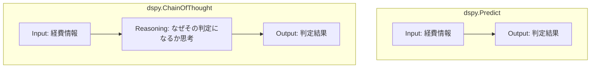

# Chapter 2: 入出力設計（Signature）& モジュール構築（Module）

本章では、DSPy の最も基本となる「入出力の型契約（Signature）」と「推論モジュール（Module）」の書き方をマスターします。

---

## 1. Signature の定義: 2つのスタイル

Signature は、LLM に対して「何を入力し、何を出力するか」を定義するインターフェースです。

### 記法 A: クラスベース定義（推奨・実務向け）
Pydantic 風にフィールドごとの型や説明文（`desc`）を明記できます。チーム開発や複雑なタスクではこちらを推奨します。

```python
import dspy

class ExpenseApprovalSignature(dspy.Signature):
    """提出された経費申請内容を審査し、承認(approved)または否認(rejected)を判定する。"""

    expense_details: str = dspy.InputField(desc="経費申請の詳細（品目、金額、理由等）")
    approval_status: str = dspy.OutputField(desc="approved または rejected")
```

### 記法 B: インライン定義（簡易プロトタイピング向け）
文字列で簡潔に宣言できます。

```python
# "入力1, 入力2 -> 出力1, 出力2"
qa_sig = dspy.Signature("context, question -> answer")
sentiment_sig = dspy.Signature("text -> sentiment: str")
```

> [!TIP]
> `desc`（説明文）やクラスの Docstring は、Optimizer が指示文を自動拡張する際の**シード（手がかり）**として利用されます。

---

## 2. 推論モジュール（Modules）の選定と使い分け

DSPy には LLM の思考プロセスを決定するビルディングブロックが用意されています。

| モジュール | 動作 | 適用ユースケース | コスト / 速度 |
| :--- | :--- | :--- | :--- |
| **`dspy.Predict`** | 入力から直接出力を生成 | 単純分類、エンティティ抽出、短い定型変換 | 最速・最安 (トークン消費小) |
| **`dspy.ChainOfThought`** | `reasoning` フィールドを前挿入して思考 | 論理的推論、複数条件の判定、要約、審査 | 高精度 (+5〜15% 向上), 中速 |
| **`dspy.ReAct`** | Thought ➔ Action (Tool) ➔ Observation ループ | 外部検索、コード実行、Web検索を伴うAgent | 高機能, 複数回LLM呼出 |



### コード例: 自作 Module の実装

```python
class ExpenseClassifier(dspy.Module):
    def __init__(self):
        super().__init__()
        # ChainOfThought をラップ
        self.prog = dspy.ChainOfThought(ExpenseApprovalSignature)

    def forward(self, expense_details: str):
        # 呼び出し時は名前付き引数で渡す
        return self.prog(expense_details=expense_details)
```

---

## 3. `dspy.inspect_history()` による内部プロンプトの観察

DSPy が実際にどのようなプロンプトを組み立てて LLM に送信したかは、`dspy.inspect_history(n=1)` で即座に確認できます。

```python
lm = dspy.LM("openai/gpt-4o-mini")
dspy.configure(lm=lm)

classifier = ExpenseClassifier()
result = classifier(expense_details="クライアントとの懇親会飲食代 15,000円")

# 最新 1 件の LLM 送信プロンプトと応答を表示
dspy.inspect_history(n=1)
```

---

## 4. 理解度チェック & ミニクイズ

<details>
<summary><b>Q1. 単純な「テキスト分類（ポジティブ/ネガティブ判定）」に dspy.Predict と dspy.ChainOfThought のどちらを使うべきですか？</b></summary>

**A1.** 
- 速度とコストを最優先する場合 ➔ **`dspy.Predict`**（思考ステップをスキップして出力のみ生成するためトークンが節約できます）。
- 微妙なニュアンスの解釈や高精度を求めたい場合 ➔ **`dspy.ChainOfThought`**（`reasoning` を出力させることでLLMの思考が安定し、精度が向上します）。
</details>

<details>
<summary><b>Q2. `dspy.ChainOfThought` を使う際、Signature に `reasoning` フィールドを自分で定義する必要はありますか？</b></summary>

**A2.** 必要ありません。`dspy.ChainOfThought` が自動的に Signature の先頭に `reasoning: OutputField` を注入します。
</details>

---

- 前の章: [Chapter 1: メンタルモデル (01_mental_model.md)](01_mental_model.md)
- 次の章: [Chapter 3: 評価関数エンジニアリング (03_metric_engineering.md)](03_metric_engineering.md)
