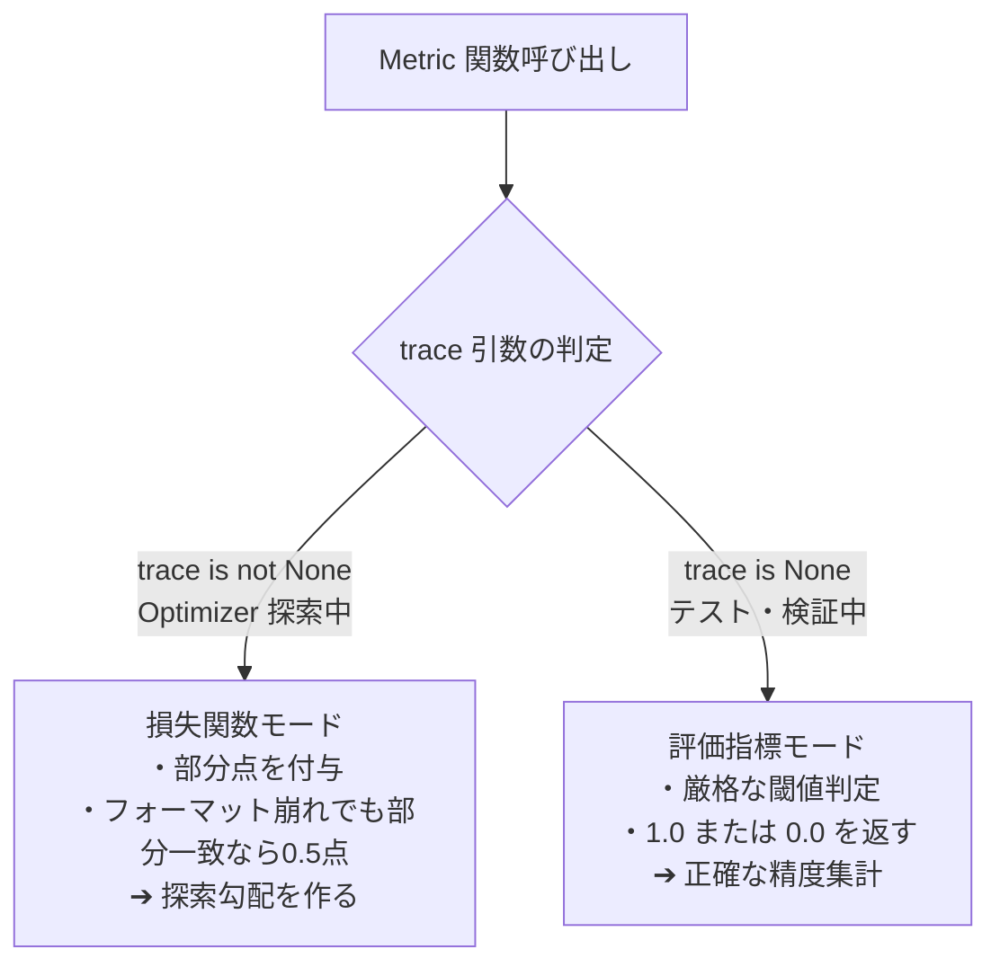

# Chapter 3: 評価関数（Metric）エンジニアリング

DSPy において、Optimizer の探索性能を左右する最も重要な要素が **「評価関数（Metric）」** です。
評価関数が粗悪だと、どれだけ優れた Optimizer を使ってもプロンプトは改善しません。

---

## 1. データセットの準備と `dspy.Example`

DSPy では学習・検証データを `dspy.Example` オブジェクトとして表現します。

```python
import dspy

example = dspy.Example(
    expense_details="クライアントとの懇親会飲食代 15,000円 (参加者3名、事前伺い済)",
    expected_status="approved",
    department="営業部"
).with_inputs("expense_details")
```

> [!IMPORTANT]
> **`.with_inputs("フィールド名")` の指定が必須**:
> `with_inputs()` を呼び出すことで、どのフィールドを「モデルへの入力」とし、どのフィールドを「評価用の正解ラベル（メタデータ）」とするかを明確に切り分けます。

---

## 2. Metric 関数のインターフェースと `trace` 引数の二重性

DSPy の評価関数は以下の標準シグネチャを持ちます：

```python
def my_metric(example, pred, trace=None) -> float:
    # 0.0 〜 1.0 のスコア（または bool）を返す
```

### なぜ `trace` 引数が重要なのか？（評価関数と損失関数の二重役割）

| 実行フェーズ | `trace` の値 | 役割 | 推奨される戻り値 |
| :--- | :--- | :--- | :--- |
| **学習時 (Optimization中)** | `trace is not None` (実行トレースが入る) | **損失関数 (Loss Function)** | **連続値スコア（部分点あり）**<br>例: 0.0, 0.5, 0.8, 1.0 |
| **評価時 (Test/Validation)** | `trace is None` | **評価指標 (Evaluation Metric)** | **厳格な判定スコア**<br>例: 1.0 (合格) / 0.0 (不合格) |



### 実装例:

```python
def robust_metric(example, pred, trace=None) -> float:
    gold = getattr(example, "expected_status", "").strip().lower()
    predicted = getattr(pred, "approval_status", "").strip().lower()

    is_exact = (gold == predicted)

    if trace is not None:
        # 学習時は部分点を与えてOptimizerの探索を促す
        if is_exact:
            return 1.0
        elif gold in predicted:  # 余計な文字が含まれているが正解単語がある
            return 0.5
        return 0.0

    # 評価時は完全一致のみ 1.0
    return 1.0 if is_exact else 0.0
```

---

## 3. LLM-as-a-Judge における Reward Hacking（報酬ハック）対策

複雑なタスク（要約、論理審査）で LLM に採点させる場合、Optimizer が「長文を書けば高得点になりやすい」といった採点の抜け穴を学習してしまう **Reward Hacking** が起きることがあります。

### ガードレール設計:
1. **`reasoning` の必須化**: スコアを出す前に必ず論理的な理由を出力させる。
2. **負のペナルティ明記**: Signature に `"Do not reward verbosity"` や `"Penalize hallucinations"` を明記する。

```python
class JudgeSignature(dspy.Signature):
    """回答の妥当性を評価する。長文であることに対して加点してはならない。"""
    criterion: str = dspy.InputField(desc="評価基準")
    gold_answer: str = dspy.InputField(desc="正解データ")
    prediction: str = dspy.InputField(desc="モデルの予測")
    reasoning: str = dspy.OutputField(desc="採点に至った論理的な理由")
    score: float = dspy.OutputField(desc="0.0〜1.0のスコア")
```

---

## 4. `dspy.Evaluate` によるバッチ評価

データセット全体に対する並列自動評価は `dspy.Evaluate` で行います。

```python
evaluator = dspy.Evaluate(
    devset=val_dataset,
    metric=robust_metric,
    num_threads=4,
    display_progress=True,
    display_table=True,
)

score = evaluator(my_module)
print(f"Accuracy: {score:.2f}%")
```

---

## 5. 理解度チェック & ミニクイズ

<details>
<summary><b>Q1. `dspy.Example(input="A", output="B")` を作成した際、なぜ `.with_inputs("input")` を呼ぶ必要があるのですか？</b></summary>

**A1.** `with_inputs()` を呼ばないと、DSPy はどのキーが LLM への入力引数で、どのキーが評価用の正解ラベルなのかを判別できず、モジュールの推論実行時にエラーとなるためです。
</details>

<details>
<summary><b>Q2. Optimizer による探索時（学習時）、metric 関数が 0.0 または 1.0 のバイナリしか返さないとどのような問題が生じますか？</b></summary>

**A2.** 「惜しい出力（部分正解）」と「完全に的外れな出力」が同じ 0.0 点として扱われるため、Optimizer がどの方向にプロンプトを改善すればよいかの手がかり（勾配/シグナル）を失い、最適化が停滞しやすくなります。
</details>

---

- 前の章: [Chapter 2: 入出力設計 & モジュール (02_signature_and_modules.md)](02_signature_and_modules.md)
- 次の章: [Chapter 4: 自動最適化（Optimizer）の実践 (04_optimizers_in_depth.md)](04_optimizers_in_depth.md)
