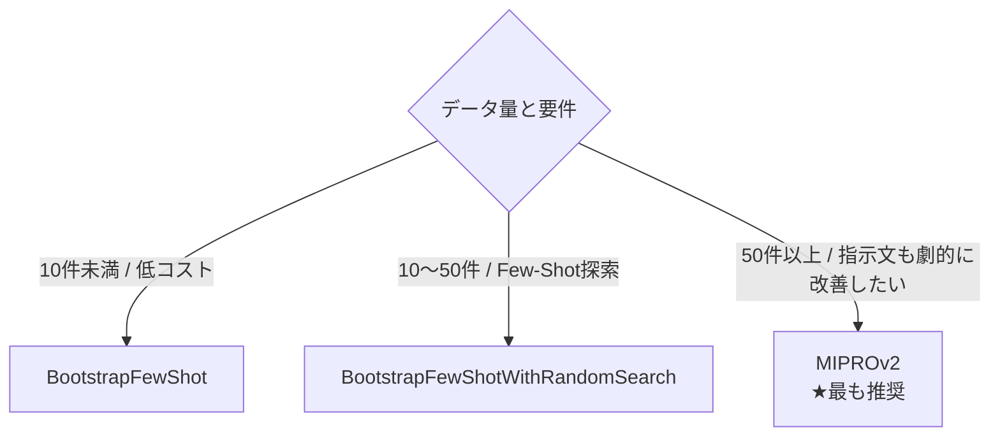
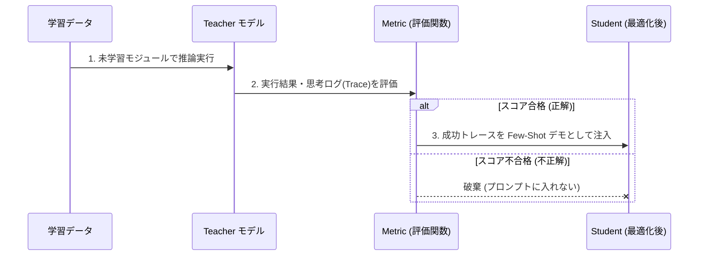
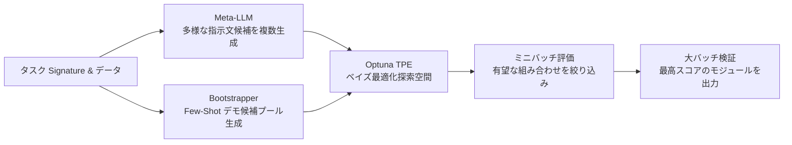

# Chapter 4: 自動最適化（Optimizer）の実践

DSPy の真価は、評価メトリクスに基づいてプロンプト（Few-Shot例および指示文）をアルゴリズム的に自動進化させる **Optimizer（オプティマイザ）** にあります。

---

## 1. Optimizer の選定マトリクス

データセットの件数、許容計算コスト、目的に応じて最適な Optimizer を選択します。

| データ量目安 | 推奨 Optimizer | 最適化対象 | 特徴・使いどころ |
| :--- | :--- | :--- | :--- |
| **〜10件** | `BootstrapFewShot` | Few-Shot デモ例 | 最速・低コスト。成功した実行トレースをプロンプトに埋め込む。 |
| **10〜50件** | `BootstrapFewShotWithRandomSearch` | Few-Shot デモ例 | 複数パターンのデモ候補をランダム探索し、最も高スコアな組み合わせを選択。 |
| **50件〜200件以上** | **`MIPROv2`** (業界標準) | **指示文 + Few-Shot** | **Meta-LLM による指示文自動生成 ＋ Optuna ベイズ最適化**。最大の性能向上。 |
| **類似検索** | `KNNFewShot` | Few-Shot デモ例 | 入力テキストに意味的に最も近い事例を実行時に動的取得（埋め込み利用）。 |
| **指示文のみ** | `COPRO` | 指示文 (Instruction) | Few-Shot を増やさずにプロンプトを短く保ちたい場合。 |



---

## 2. `BootstrapFewShot` の動作メカニズム

手作業で Few-Shot 例を選ぶと「人間が良かれと思った例」になりがちですが、`BootstrapFewShot` は **「LLM 自身が正しく解けたトレース」** のみを自動抽出してデモにします。



### 実装コード:
```python
from dspy.teleprompt import BootstrapFewShot

optimizer = BootstrapFewShot(
    metric=approval_metric,
    max_bootstrapped_demos=3,  # 自動生成するデモ例の最大数
    max_labeled_demos=3,       # 正解ラベル付き例の最大数
)

compiled_module = optimizer.compile(
    student=ExpenseApprovalModule(),
    trainset=train_data,
)
```

---

## 3. `MIPROv2` (Multiprompt Instruction PRoposal Optimizer v2) の威力

`MIPROv2` は現在プロダクション開発で最も推奨される最先端 Optimizer です。



1. **Instruction Proposal (指示文提案)**: Meta-LLM が Signature とデータを分析し、多角的な指示文（詳細版、簡潔版、逆説的思考版など）を自動生成。
2. **Bayesian Optimization (ベイズ探索)**: Optuna の TPE アルゴリズムを用い、指示文と Few-Shot デモの膨大な組み合わせ空間から最高精度のプロンプトを効率的に発見。

### 実装コード:
```python
from dspy.teleprompt import MIPROv2

teleprompter = MIPROv2(
    metric=triage_metric,
    auto="light",       # 'light', 'medium', 'heavy'
    num_candidates=5,   # 指示文候補数
    num_trials=10,      # 試行回数
)

compiled_module = teleprompter.compile(
    student=SupportTriageModule(),
    trainset=trainset,
    valset=valset,
)

# 最適化済みモジュールの保存
compiled_module.save("outputs/optimized_module.json")
```

---

## 4. 理解度チェック & ミニクイズ

<details>
<summary><b>Q1. 訓練データが 5 件しかない場合、MIPROv2 と BootstrapFewShot のどちらを選ぶべきですか？</b></summary>

**A1.** **`BootstrapFewShot`** を推奨します。MIPROv2 は指示文の提案とベイズ探索に一定の検証データを必要とするため、極小データでは過学習を起こしやすくなります。5件程度なら BootstrapFewShot で安全に Few-Shot を埋め込むのが適切です。
</details>

<details>
<summary><b>Q2. 最適化したプロンプトの文字列だけをコピーして、DSPy を使わない別のコードに移植しても同じ性能が出ますか？</b></summary>

**A2.** **同じ性能が出ない可能性があります。** 論文の調査結果によると、DSPy は内部での入出力フォーマット（パーサーや思考ステップの管理）とプロンプトが密結合して動作するため、最適化済み `dspy.Module` を `save()` / `load()` して DSPy 内で実行することが推奨されます。
</details>

---

- 前の章: [Chapter 3: 評価関数エンジニアリング (03_metric_engineering.md)](03_metric_engineering.md)
- 次の章: [Chapter 5: LLM-as-a-Judge & Observability (05_llm_as_judge_and_tracing.md)](05_llm_as_judge_and_tracing.md)
