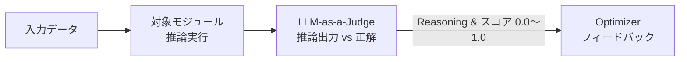
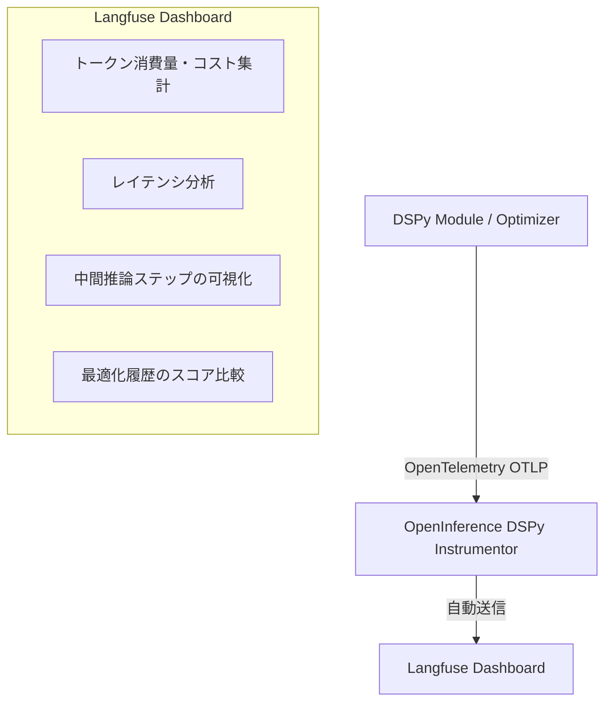

# Chapter 5: LLM-as-a-Judge, 差分比較 & Observability (可視化)

プロダクション環境で DSPy を運用するために不可欠な「LLM-as-a-Judge」「プロンプト差分確認」「Langfuse によるモニタリング」を学びます。

---

## 1. LLM-as-a-Judge との連携

自然言語の出力や要約、複雑な審査業務では、ルールベース（完全一致）ではなく **LLM を判定員（Judge）とした評価関数** を構築します。



### 本システム（`LaaJ-dspy-looper`）での利用例:
```yaml
# experiments/my_experiment.yaml
metric:
  name: "llm_judge"
  field: "approval_status"
```

---

## 2. 最適化前後のプロンプト差分確認 (`laaj diff`)

Optimizer がプロンプトをどのように改善したかを定量・定性的に確認します。

```bash
# 差分表示コマンド
uv run laaj diff --config experiments/example.yaml --module-path outputs/example_classification/optimized_module.json
```

### 出力例:
```text
============================================================
⚡ プロンプト最適化 差分レポート
============================================================

[Predictor: classifier]
  📝 指示文 (Instruction) の変更:
    - Before: テキストを分類するタスク
    + After : 顧客の文脈とトーンを考慮し、不満やトラブルに関する発言は negative、感謝や満足は positive と分類する。
  🎯 Few-Shot Demos: 0 件 ➔ 4 件 (差分: +4 件)
  💡 注入されたデモ例:
     Demo 1: {'text': 'バグが多くて使い物になりません', 'label': 'negative'}
     Demo 2: {'text': 'UIが直感的で操作しやすい', 'label': 'positive'}

============================================================
```

---

## 3. Langfuse によるトレーシングと可視化

`openinference-instrumentation-dspy` を介して、DSPy の内部実行を Langfuse に自動送信します。



### 設定方法:
`.env` に Langfuse のキーを記述し、YAML で `backend: "langfuse"` を指定するだけです。

```env
LANGFUSE_PUBLIC_KEY="pk-lf-..."
LANGFUSE_SECRET_KEY="sk-lf-..."
LANGFUSE_HOST="https://cloud.langfuse.com"
```

---

## 4. プロダクション導入チェックリスト

- [ ] **評価データセットの分離**: Train / Validation / Test を完全に分離し、Test セットで最終評価しているか？
- [ ] **モデル変更時の自動再コンパイル**: CI/CD パイプライン内で定期的に `laaj optimize` が実行できる環境があるか？
- [ ] **トレーシングの常時有効化**: Langfuse 等で異常出力やコスト増加を監視しているか？
- [ ] **永続化モジュールの管理**: `module.save()` で生成された JSON ファイルをバージョン管理しているか？

---

## 5. 理解度チェック & ミニクイズ

<details>
<summary><b>Q1. プロンプト最適化において、Train データだけで評価してはいけない理由は何ですか？</b></summary>

**A1.** **過学習（Overfitting）** が発生するためです。特定の Few-Shot 例や指示文が Train データのみに過剰適合し、未知の入力に対して精度が落ちるリスクがあります。必ず Train / Val / Test に分割し、最終評価は未見の Test セットで行います。
</details>

<details>
<summary><b>Q2. Langfuse などのトレーシングツールを導入する最大のメリットは何ですか？</b></summary>

**A2.** 最適化中に LLM が何千回呼び出されたかのコスト概算、レイテンシ、どの中間ステップで失敗したかのボトルネック特定がリアルタイムでダッシュボード上に可視化される点です。
</details>

---

- 前の章: [Chapter 4: 自動最適化の実践 (04_optimizers_in_depth.md)](04_optimizers_in_depth.md)
- 目次へ戻る: [Index](../INDEX.md)
